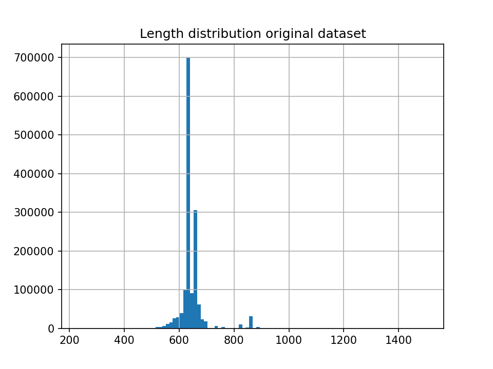
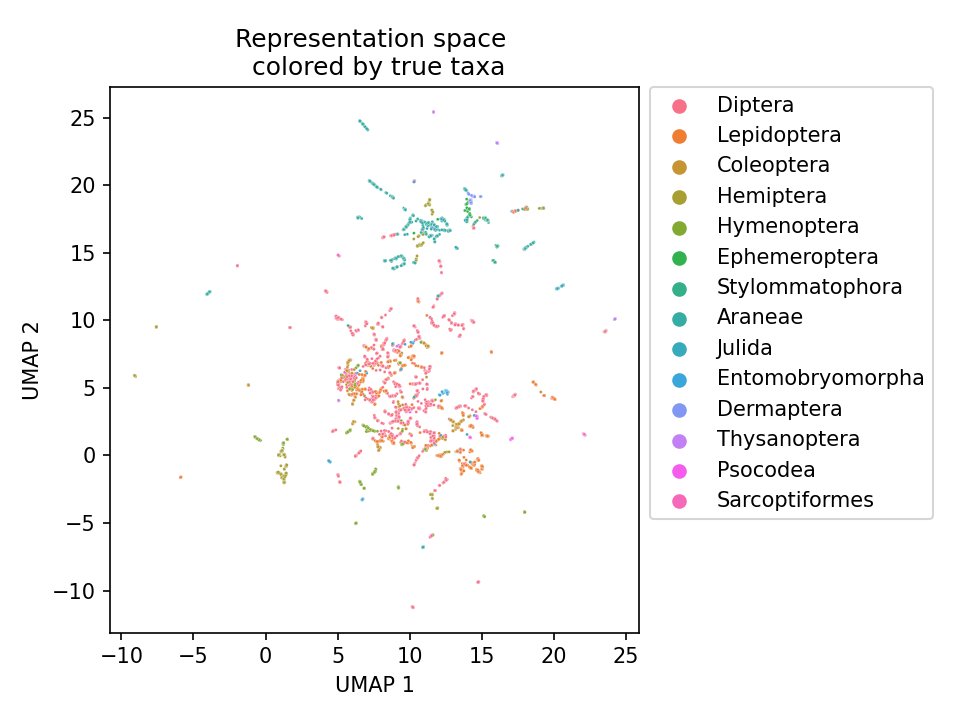

# Bumblebee

A pre-trained representation from a transformers model for inference on insect DNA barcoding data. 

*Note*: If you have been here before, you will note that the code is not a mess anymore. Shoutout to Niousha and Monireh. We do not need Hugging-Face as the entire architecture was implemented from scratch by them


1. Make sure you have all the required libraries before running (remove the --no-index flags if you are not training on CC)

```
./DNABERT.sh
```

Our new vocabulary consists of {A, C, G, T, N}.

Progress on the Bioscan transformers project so far:

1. Describe the original data [1.5M barcodes dataset](https://www.nature.com/articles/s41597-019-0320-2#Sec22) and report them.

| phylum_name     |      processid |       sampleid |   bin_uri |   class_name |   order_name |   family_name |   genus_name |   species_name |    nucleotides |
|:----------------|---------------:|---------------:|----------:|-------------:|-------------:|--------------:|-------------:|---------------:|---------------:|
| Annelida        | 3086           | 3086           |       520 |            2 |           17 |            49 |          152 |            335 | 2121           |
| Arthropoda      |    1.49283e+06 |    1.49283e+06 |     64082 |           15 |           68 |           933 |         6246 |          16733 |    1.06563e+06 |
| Brachiopoda     |   23           |   23           |         3 |            1 |            2 |             2 |            2 |              3 |   20           |
| Bryozoa         |    6           |    6           |         4 |            4 |            4 |             4 |            3 |              3 |    5           |
| Chordata        |  479           |  479           |       103 |            5 |           19 |            38 |           68 |             90 |  290           |
| Cnidaria        |  206           |  206           |        47 |            4 |           11 |            25 |           26 |             25 |  113           |
| Echinodermata   |  422           |  422           |        79 |            5 |           17 |            26 |           43 |             74 |  276           |
| Hemichordata    |    4           |    4           |         2 |            1 |            1 |             1 |            2 |              2 |    4           |
| Mollusca        | 3251           | 3251           |       373 |            7 |           31 |            98 |          163 |            272 | 1931           |
| Nematoda        |   33           |   33           |         9 |            2 |            5 |            11 |            6 |              3 |   24           |
| Nemertea        |   81           |   81           |        22 |            4 |            3 |             6 |            6 |              6 |   56           |
| Platyhelminthes |    1           |    1           |         1 |            1 |            1 |             1 |            1 |              1 |    1           |
| Porifera        |    7           |    7           |         6 |            1 |            3 |             4 |            5 |              4 |    7           |
| Priapulida      |    1           |    1           |         1 |            1 |            1 |             1 |            1 |              1 |    1           |
| Tardigrada      |    1           |    1           |         1 |            1 |            1 |             1 |            1 |              1 |    1           |



2.  Pre-processing steps:
    * Remove empty entries in the "Nucleotides" column.
    * Replace all non-ACGT symbols including gaps for 'N's
    * Remove sequence duplicates
    * Find inconsistent labels at the species level
    * Remove trailing 'N's 
    * Remove all the sequences shorter than 200.
    * Remove all sequences with more than 50% as 'N'


| phylum_name     |   processid |   sampleid |   bin_uri |   class_name |   order_name |   family_name |   genus_name |   species_name |   nucleotides |   sequence_len |
|:----------------|------------:|-----------:|----------:|-------------:|-------------:|--------------:|-------------:|---------------:|--------------:|---------------:|
| Annelida        |        2102 |       2102 |       516 |            2 |           16 |            48 |          150 |            329 |          2102 |             52 |
| Arthropoda      |      969247 |     969247 |     64067 |           14 |           67 |           932 |         6244 |          16661 |        969247 |            421 |
| Brachiopoda     |          20 |         20 |         2 |            1 |            2 |             2 |            2 |              2 |            20 |              4 |
| Bryozoa         |           5 |          5 |         4 |            3 |            3 |             3 |            2 |              2 |             5 |              4 |
| Chordata        |         289 |        289 |       102 |            5 |           18 |            37 |           67 |             89 |           289 |              9 |
| Cnidaria        |         112 |        112 |        46 |            4 |           10 |            24 |           25 |             24 |           112 |              9 |
| Echinodermata   |         276 |        276 |        79 |            5 |           17 |            26 |           43 |             74 |           276 |             13 |
| Hemichordata    |           4 |          4 |         2 |            1 |            1 |             1 |            2 |              1 |             4 |              2 |
| Mollusca        |        1912 |       1912 |       372 |            6 |           30 |            97 |          162 |            271 |          1912 |             71 |
| Nematoda        |          24 |         24 |         8 |            2 |            5 |            10 |            5 |              2 |            24 |              4 |
| Nemertea        |          56 |         56 |        22 |            3 |            2 |             5 |            5 |              5 |            56 |              4 |
| Platyhelminthes |           1 |          1 |         1 |            0 |            0 |             0 |            0 |              0 |             1 |              1 |
| Porifera        |           7 |          7 |         5 |            1 |            3 |             4 |            4 |              3 |             7 |              2 |
| Priapulida      |           1 |          1 |         1 |            1 |            1 |             1 |            1 |              1 |             1 |              1 |
| Tardigrada      |           1 |          1 |         1 |            1 |            1 |             1 |            0 |              0 |             1 |              1 |

**NOTE**: There are 119 species for which at least one of its sequences is duplicated and labeled with another species' name. All the sequences in those species are in the pre-processing dataset.

3. Split the dataset into:
    * **Supervised Seen:** Dataset for evaluating the capacity of the model to learn the species label. This will be split into training (70%), testing(20%) and validation (10%). 
    * **Unseen**: Dataset for evaluating the quality of the learned embeddings.
    * **Unsupervised Pretraining:** Dataset containing the rest of the sequences, here we will have sequences with incomplete taxonomic annotations or sequences in the problematic species. 

4. Script to test the 1D-CNN architecture `1D_CNN_supervised.py` for supervised and `1D_CNN_metric.py` for testing the metric learning on the unseen dataset.

```console
-----------------------------------------------------------
| end of epoch 199 | time: 20.77s | Test accuracy    0.976 
-----------------------------------------------------------
```



```console
Best Metric:  manhattan 
Accuracy 1-kNN:  0.8702000000000004
```

5. Script to train the Bert-like architecture as an MLM. 

6. Evaluate the MLM for metric learning.


7. Script to test the BERT-Like architecture for supervised and metric learning.

8. Script to test the CCT architecture for supervised and metric learning.

