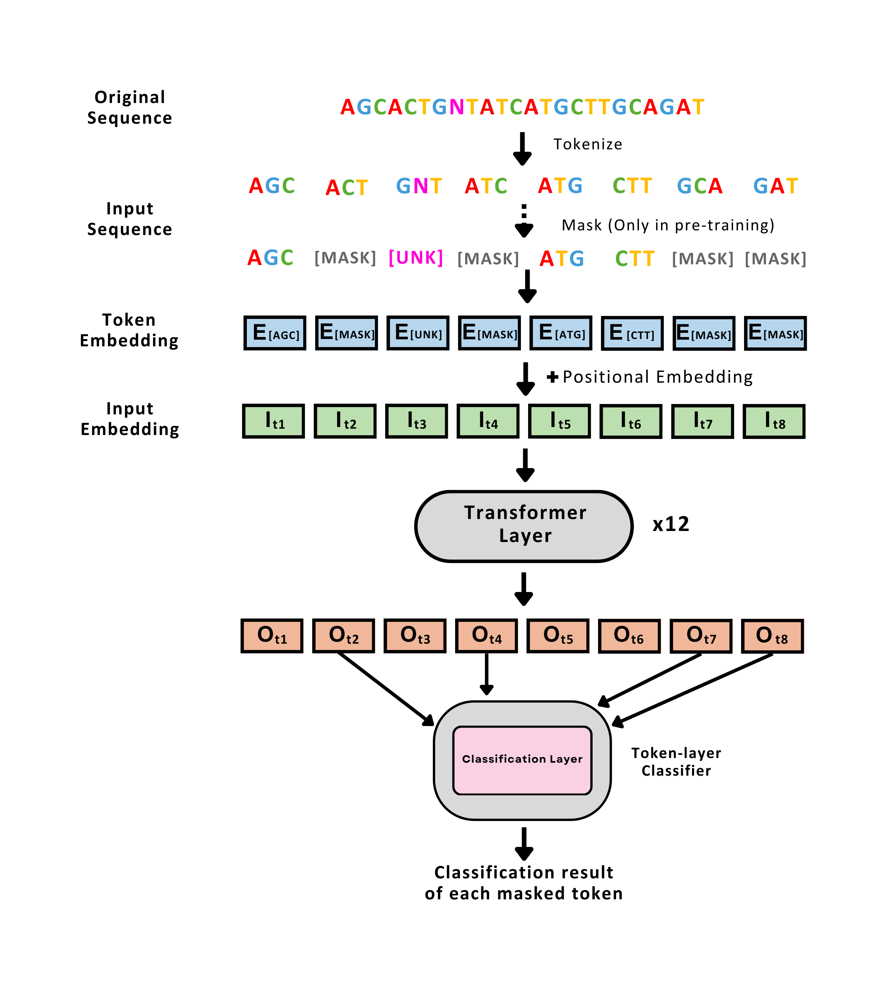

# BarcodeBERT

A pre-trained transformer model for inference on insect DNA barcoding data.

<p align="center">
  
</p>

* Check out our [paper](https://arxiv.org/abs/2311.02401)
* Check out our [poster](https://vault.cs.uwaterloo.ca/s/iixEfyeXMt8g3pi)

#### Model weights

[4-mers](https://vault.cs.uwaterloo.ca/s/5XdqgegTC6xe2yQ)  
[5-mers](https://vault.cs.uwaterloo.ca/s/Cb6yzBpPdHQzjzg)  
[6-mers](https://vault.cs.uwaterloo.ca/s/GCfZdeZEDCcdSNf)  


### Reproducing the results from the paper

0. Clone this repository and install the required libraries by running
```shell
pip install -e .
```

1. Download the [data](https://vault.cs.uwaterloo.ca/s/x7gXQKnmRX3GAZm)
```shell
wget https://vault.cs.uwaterloo.ca/s/x7gXQKnmRX3GAZm/download -O data.zip
unzip data.zip
mv new_data/* data/
rm -r new_data
rm data.zip
```

##### CNN model
Training:
```bash
cd scripts/CNN/
python 1D_CNN_supervised.py
```

Evaluation:
```bash
python 1D_CNN_genus.py
python 1D_CNN_Linear_probing.py
```

##### BarcodeBERT

Model Pretraining:
```bash
python barcodebert/pretraining.py --data_path=data/pre_training.csv --k_mer=4 --stride=4
python barcodebert/pretraining.py --data_path=data/pre_training.csv --k_mer=5 --stride=5
python barcodebert/pretraining.py --data_path=data/pre_training.csv --k_mer=6 --stride=6
```

Evaluation:
```bash
python barcodebert/knn_probing.py --k_mer=4 --input_path=data/ --stride=4 --Pretrained_checkpoint_path=model_checkpoints/4_model_12_12_35.pth
python barcodebert/knn_probing.py --k_mer=5 --input_path=data/ --stride=5 --Pretrained_checkpoint_path=model_checkpoints/5_model_12_12_35.pth
python barcodebert/knn_probing.py --k_mer=6 --input_path=data/ --stride=6 --Pretrained_checkpoint_path=model_checkpoints/6_model_12_12_35.pth

python barcodebert/linear_probing.py --k_mer=4 --input_path=data/ --stride=4 --Pretrained_checkpoint_path=model_checkpoints/4_model_12_12_35.pth
python barcodebert/linear_probing.py --k_mer=5 --input_path=data/ --stride=5 --Pretrained_checkpoint_path=model_checkpoints/5_model_12_12_35.pth
python barcodebert/linear_probing.py --k_mer=6 --input_path=data/ --stride=6 --Pretrained_checkpoint_path=model_checkpoints/6_model_12_12_35.pth
```

Model Fine-tuning
To fine-tune the model, you need a folder with three files: "train," "test," and "dev." Each file should have two columns, one called "sequence" and the other called "label." You also need to specify the path to the pre-trained model you want to use for fine-tuning, using "pretrained_checkpoint_path".
```bash
python barcodebert/finetuning.py --data_path=path_to_input_folder --Pretrained_checkpoint_path=path_to_pretrained_model --k_mer=4 --stride=4
python barcodebert/finetuning.py --data_path=path_to_input_folder --Pretrained_checkpoint_path=path_to_pretrained_model --k_mer=5 --stride=5
python barcodebert/finetuning.py --data_path=path_to_input_folder --Pretrained_checkpoint_path=path_to_pretrained_model --k_mer=6 --stride=6
```


##### DNABERT
To fine-tune the model on our data, you first need to follow the instructions in the [DNABERT repository](https://github.com/jerryji1993/DNABERT) original repository to donwnload the model weights. Place them in the `dnabert` folder and then run the following:

```bash
cd scripts/DNABERT/
python supervised_learning.py --data_path=../../data -k 4 --model dnabert --checkpoint dnabert/4-new-12w-0
python supervised_learning.py --data_path=../../data -k 6 --model dnabert --checkpoint dnabert/6-new-12w-0
python supervised_learning.py --data_path=../../data -k 5 --model dnabert --checkpoint dnabert/5-new-12w-0
```


###### DNABERT-2

To fine-tune the model on our dataset, you need to follow the instructions in [DNABERT2 repository](https://github.com/Zhihan1996/DNABERT_2) for fine-tuning the model on new dataset. You can use the same input path that is used for fine-tuning BarcodeBERT as the input path to DNABERT2.


## Citation

If you find BarcodeBERT useful in your research please consider citing:

    @misc{arias2023barcodebert,
      title={{BarcodeBERT}: Transformers for Biodiversity Analysis},
      author={Pablo Millan Arias
        and Niousha Sadjadi
        and Monireh Safari
        and ZeMing Gong
        and Austin T. Wang
        and Scott C. Lowe
        and Joakim Bruslund Haurum
        and Iuliia Zarubiieva
        and Dirk Steinke
        and Lila Kari
        and Angel X. Chang
        and Graham W. Taylor
      },
      year={2023},
      eprint={2311.02401},
      archivePrefix={arXiv},
      primaryClass={cs.LG},
      doi={10.48550/arxiv.2311.02401},
    }


## Development

Our code is automatically standardized using [pre-commit](https://pre-commit.com/).

When developing the codebase, please install pre-commit and our pre-commit hooks with the following code:

```bash
pip install -e .[dev]
pre-commit install
```

This will then automatically change your code style to the [black](https://github.com/psf/black) format when you try to commit it, and catch any [flake8](https://flake8.pycqa.org/) errors.
If there are any corrections automatically made by pre-commit or corrections you need to implement, the commit will not initially go through until you stage the appropriate changes and try to commit again.


<!---

### Using BarcodeBERT as feature extractor in your own biodiversity analysis:

0. Clone this repository and install the required libraries

1. Download the pre-trained weights

2. Produce the features
**Note**: The model is ready to be used on data directly downloaded from BOLD. To use the model on your own data, please format the .csv input file accordingly.


### Fine-Tuning BarcodeBERT using your own data

0. Clone this repository and install the required libraries

1. Download the pre-trained weights

2. Fine-Tune the model
**Note**: The model is ready to be used on data directly downloaded from BOLD. To use the model on your own data, please format the .csv input file accordingly.

3. Test the fine-tuned model on the test dataset.


0. Download the [data](https://vault.cs.uwaterloo.ca/s/YojSrfn7n2iLfa9)
1. Make sure you have all the required libraries before running (remove the --no-index flags if you are not training on CC)

```
pip install -r requirements.txt
```

--!>
