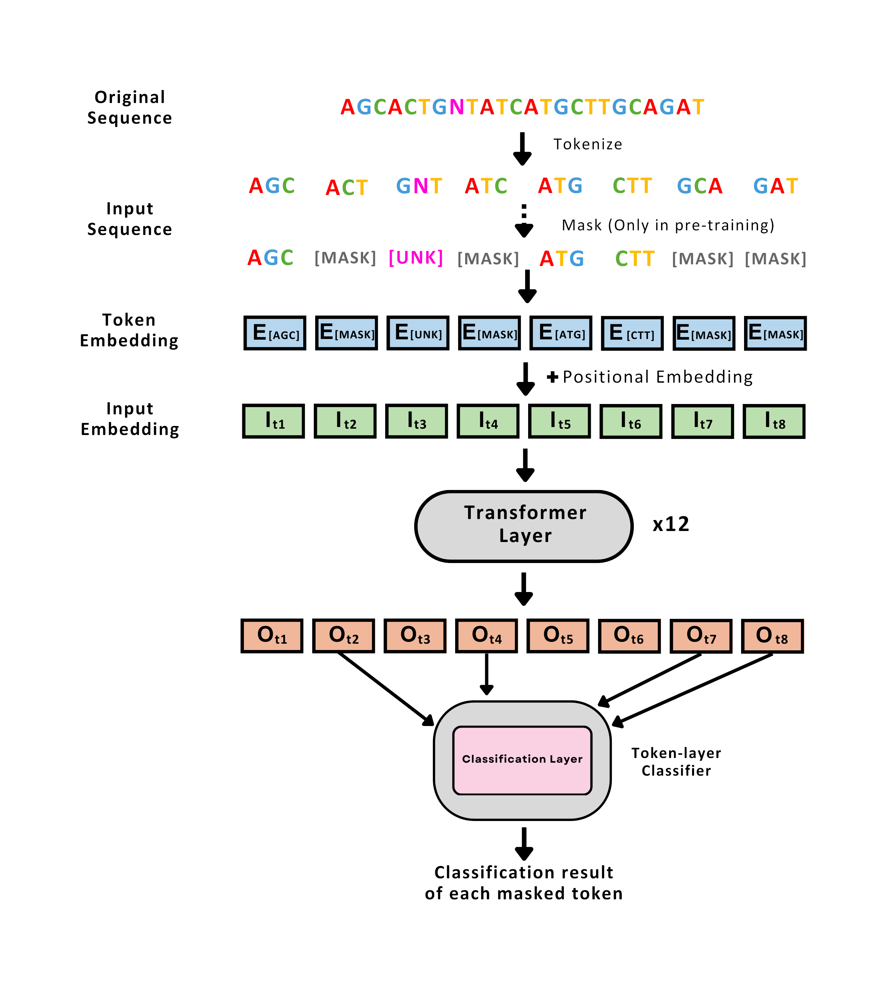

# BarcodeBERT (Soft Levenshtein Penalty)

A pre-trained transformer model for inference on insect DNA barcoding data. 

Model Pretraining:
```
cd /scripts/soft_BarcodeBERT
pip install --no-index -r requirements.txt
python soft_MGPU_MLM_train.py --input_path=[DATA-FOLDER]/pre_training.tsv --k_mer=4 --stride=4 --epoch=20 --n_layers=2 --n_heads=2

```

Evaluation:
```
python soft_knn_probing.py --input_path=[DATA-FOLDER] --Pretrained_checkpoint_path=[CHECKPOINTS-FOLDER]/4_soft_model_2_2_20.pth  --k_mer=4 --stride=4 --n_layers=2 --n_heads=2
python soft_linear_probing.py --input_path=[DATA-FOLDER]--Pretrained_checkpoint_path=[CHECKPOINTS-FOLDER]/4_soft_model_2_2_20.pth  --k_mer=4 --stride=4 --n_layers=2 --n_heads=2

```

Model Fine-tuning
To fine-tune the model, you need a folder with three files: "train," "test," and "dev." Each file should have two columns, one called "sequence" and the other called "label." You also need to specify the path to the pre-trained model you want to use for fine-tuning, using "pretrained_checkpoint_path".
```
python soft_fine_tuning.py --input_path=[DATA-FOLDER] --Pretrained_checkpoint_path=[CHECKPOINTS-FOLDER]/4_soft_model_2_2_20.pth  --k_mer=4 --stride=4 --epoch=35 --n_layers=2 --n_heads=2
```


<p align="center">
  
</p>

* Check out our [paper](https://arxiv.org/abs/2311.02401)
* Check out our [poster](https://vault.cs.uwaterloo.ca/s/iixEfyeXMt8g3pi)

#### Model weights

[4-mers](https://vault.cs.uwaterloo.ca/s/5XdqgegTC6xe2yQ)  
[5-mers](https://vault.cs.uwaterloo.ca/s/Cb6yzBpPdHQzjzg)  
[6-mers](https://vault.cs.uwaterloo.ca/s/GCfZdeZEDCcdSNf)  


### Reproducing the results from the paper

0. Clone this repository and install the required libraries by running
```shell
pip install -e .
```

1. Download the [data](https://vault.cs.uwaterloo.ca/s/x7gXQKnmRX3GAZm)

##### CNN model
Training: 
```
cd paper/CNN
python supervised_learning.py
```

Evaluation:
```
python genus_1NN.py
python Linear_probing.py
```

##### BarcodeBERT

Model Pretraining:
```
cd /paper/BarcodeBERT
pip install --no-index -r requirements.txt
python MGPU_MLM_train.py --input_path=../../data/pre_training.tsv --k_mer=4 --stride=4
python MGPU_MLM_train.py --input_path=../../data/pre_training.tsv --k_mer=5 --stride=5
python MGPU_MLM_train.py --input_path=../../data/pre_training.tsv --k_mer=6 --stride=6
```

Evaluation:
```
python MLM_genus_test.py 4
python MLM_genus_test.py 5
python MLM_genus_test.py 6

python Linear_probing.py 4
python Linear_probing.py 5
python Linear_probing.py 6
```

Model Fine-tuning
To fine-tune the model, you need a folder with three files: "train," "test," and "dev." Each file should have two columns, one called "sequence" and the other called "label." You also need to specify the path to the pre-trained model you want to use for fine-tuning, using "pretrained_checkpoint_path".
```
python fine_tuning.py --input_path= path_to_the_input_folder --Pretrained_checkpoint_path path_to_the_pretrained_model  --k_mer=4 --stride=4
python fine_tuning.py --input_path= path_to_the_input_folder --Pretrained_checkpoint_path path_to_the_pretrained_model  --k_mer=5 --stride=5
python fine_tuning.py --input_path= path_to_the_input_folder --Pretrained_checkpoint_path path_to_the_pretrained_model  --k_mer=6 --stride=6
```


##### DNABERT
To fine-tune the model on our data, you first need to follow the instructions in the [DNABERT repository](https://github.com/jerryji1993/DNABERT) original repository to donwnload the model weights. Place them in the `dnabert` folder and then run the following:

```
cd paper/DNABERT
pip install --no-index -r requirements.txt
python supervised_learning.py --input_path=../../data -k 4 --model dnabert --checkpoint dnabert/4-new-12w-0
python supervised_learning.py --input_path=../../data -k 6 --model dnabert --checkpoint dnabert/6-new-12w-0
python supervised_learning.py --input_path=../../data -k 5 --model dnabert --checkpoint dnabert/5-new-12w-0
```


###### DNABERT-2

To fine-tune the model on our dataset, you need to follow the instructions in [DNABERT2 repository](https://github.com/Zhihan1996/DNABERT_2) for fine-tuning the model on new dataset. You can use the same input path that is used for fine-tuning BarcodeBERT as the input path to DNABERT2. 


## Citation 

If you find BarcodeBERT useful in your research please consider citing:

	@misc{arias2023barcodebert,
      title={BarcodeBERT: Transformers for Biodiversity Analysis}, 
      author={Pablo Millan Arias and Niousha Sadjadi and Monireh Safari and ZeMing Gong and Austin T. Wang and Scott C. Lowe and Joakim Bruslund Haurum and Iuliia Zarubiieva and Dirk Steinke and Lila Kari and Angel X. Chang and Graham W. Taylor},
      year={2023},
      eprint={2311.02401},
      archivePrefix={arXiv},
      primaryClass={cs.LG}
}
		
	


<!--- 

### Using BarcodeBERT as feature extractor in your own biodiversity analysis:

0. Clone this repository and install the required libraries

1. Download the pre-trained weights

2. Produce the features
**Note**: The model is ready to be used on data directly downloaded from BOLD. To use the model on your own data, please format the .tsv input file accordingly. 


### Fine-Tuning BarcodeBERT using your own data

0. Clone this repository and install the required libraries

1. Download the pre-trained weights

2. Fine-Tune the model
**Note**: The model is ready to be used on data directly downloaded from BOLD. To use the model on your own data, please format the .tsv input file accordingly. 

3. Test the fine-tuned model on the test dataset.


0. Download the [data](https://vault.cs.uwaterloo.ca/s/YojSrfn7n2iLfa9)
1. Make sure you have all the required libraries before running (remove the --no-index flags if you are not training on CC)

```
pip install -r requirements.txt
```

--!>
